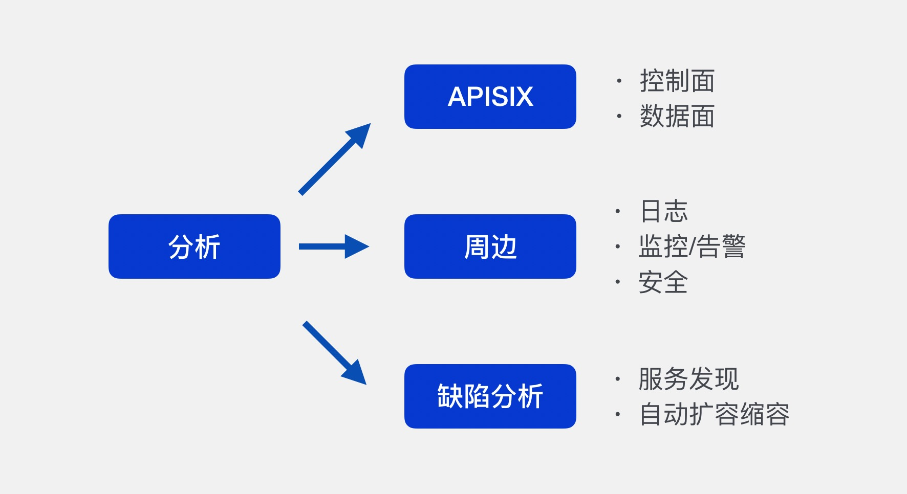
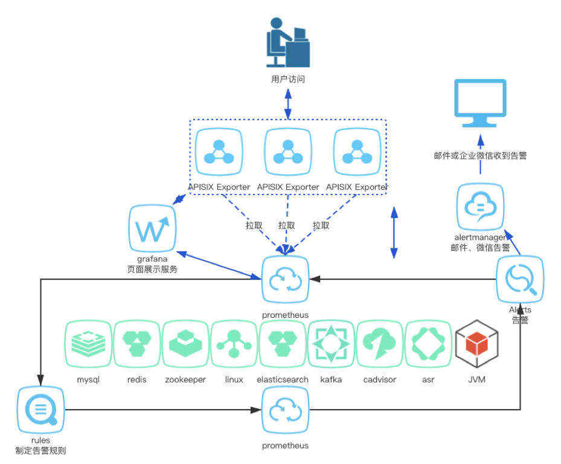
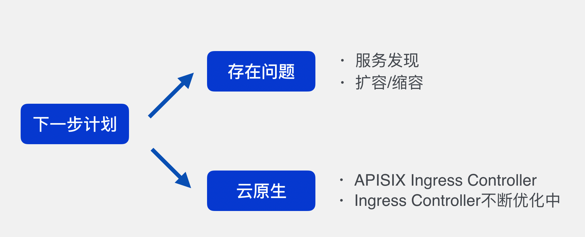

# Apache APISIX Public Cloud High Availability Architecture

As an API gateway, Apache APISIX tends to act as an enterprise edge gateway, carrying the vast majority of north-south traffic. Operations often say 5'9', 4'9', 3'9' reliability, and for edge gateways the reliability requirement is often 5'9', because edge gateways are critical to the availability of internal services, and when they are not available, the entire internal service is affected.

> What is high availability? High Availability HA (High Availability) is one of the factors that must be considered in the design of a distributed system architecture, and it usually means that the design reduces the amount of time the system is not available for service. If a system can provide service all the time, then the availability is 100 percent, but the sky is the limit. So we can only go as far as we can to minimize service failures.

## The purpose of writing this article.

1. Edge gateways are essential to have sufficient stability (high availability) APISIX tends to act as an edge gateway in a production environment, acting as a traffic entry to the entire internal service, with the entire internal service being affected if the edge gateway becomes unavailable.

2. There is a foundation for high availability at the architecture level. There are certain thresholds for designing high availability architectures for edge gateways, which require not only familiarity with edge gateways such as Nginx, Apache APISIX, etc., but also a certain foundation of high availability architectures.

3. lack of sharing of the Apache APISIX highly available architecture. On the other hand, the core maintainer's presentations are mainly at the implementation level about how Apache APISIX achieves very high forwarding performance (e.g., Yansheng Wang's "APISIX Performance Practices").

## Public Cloud High Availability Architecture

So, how do you design a highly available architecture for the public cloud?

The first thing most people think of is how highly available the APISIX data side is. If you don't figure out how to manage the API, how to ensure the correctness and consistency of the API, in the process of subsequent operation and peacekeeping, the routing configuration will be abnormal due to improper operation or node failure, which will affect the routing forwarding of the data surface, so the high availability of routing rules on the control surface also needs to be considered.

So that's a good way to rest on your laurels? How to locate the problem if the request goes wrong? How do you spot a gateway failure in advance before it turns into a major one? Gateways often store critical user information or certificate information, so how can they be secured?

So, in addition to APISIX itself being highly available, there is a need to analyze how to implement a highly available architecture based on public cloud edge gateways from the perspective of logging and log processing, monitoring and alerting, and security.

Of course, open source gateways are often not perfect, we will find some of the shortcomings of the current Apache APISIX, such as the lack of support for service discovery, and the lack of peripheral tools to support automatic scaling, I will briefly talk about my views and solutions at the end.

### Highly available data surface (route forwarding)

On the other hand, there is no guarantee that a node of the access gateway will not fail, so it is necessary to be able to automatically detect the failing node and remove it from the cluster or the master. High performance also plays an important role in ensuring high availability.

So, data side high availability typically cuts through three dimensions to find the right solution

- Clustering/main backup model
- high performance
- Fault nodes are automatically rejected.

What is clustering? A cluster is a computing node that as a whole provides a set of resources to a user. The user does not perceive the existence of this group of compute nodes when they visit; on the other hand, nodes within a cluster can be expanded and scaled by adding nodes or downstream nodes.

What is the primary mode? Keepalived is a common solution in the open source community.

The deployment performance of clustering is better because APISIX nodes are horizontally extended, and the forwarding of the cluster will increase with the number of nodes, so the deployment of natural clustering will have a certain technical threshold; while the primary mode is a single forwarding capacity is the upper limit, which has certain limitations, but the advantage is simple and easy to deploy. It is recommended that everyone prefer APISIX clustering on a public cloud.

When using the public cloud for clustering deployment, the nodes belonging to the same service are proposed to be the upstream of the same APISIX, using the load balancing and heartbeat detection capabilities of APISIX to achieve clustering of service nodes; while APISIX itself proposes to use the load balancing service of the public cloud vendor (Tencent Cloud's CLB / Ali Cloud's SLB) to hang a set of APISIX nodes behind a rule of load balancing service to achieve clustering.

Why is it recommended to use load balancing services from public cloud vendors? If you want to cluster APISIX deployments, you need to use cloud vendor services or build your own load balancing, and if you want to build your own, you need to address the high availability/clustering of load balancing from a high availability point of view. Therefore, clustering of APISIX gateways is recommended with load balancing from cloud vendors.

Of course, a better way is to choose a public cloud API gateway service and host your own API / Route, etc. on the cloud vendor's API gateway service, so that both the high availability of APISIX and the integration of peripheral components can be ignored, and you can quickly enjoy the convenience of the API gateway.

Another challenge with clustering is the need to be able to proactively and automatically eliminate APISIX nodes from a set of APISIX nodes that are failing. For example, the load balancing at layer 4 is usually to detect whether the relevant ports are connected or not, while the load balancing at layer 7 is usually to request APISIX nodes based on the configuration of the HTTP request and check whether the response is as expected.

### Highly available control surface (routing configuration)

If high availability of the data side is the cornerstone of the edge gateway, high availability of the control side is the pillar of the edge gateway.

The high availability of the control surface also has its own points to focus on, mainly in these five dimensions.

- Dashboard/Admin API
- scalability
- configuration consistency
- Configuration Center High Availability
- safety

Dashboard and Admin API is the gateway to the Admin API, through which important certificate or secret key information is obtained, is a very important node, if not properly managed, it is easy to have security risks such as secret key leakage. The standard practice here is to deploy the DashBoard and Admin API together (which can have multiple instances), with the nodes only accessible via the intranet and deployed separately from the APISIX forwarding nodes, and to hang multiple instances of the Admin API after a Route rule (usually one for each of the Dashboard and Admin API), and then to bind an authentication plugin to that Route rule (either oauth or basic-auth authentication will work).

The advantages are many: the Admin API is deployed in clusters by mounting on APISIX, and can still provide services when a node is unavailable; the Dashboard and Admin API can be protected by APISIX authentication plug-ins after mounting on APISIX Route to avoid leakage of important information; the common practice of many people is to deploy the Dashboard, etc. on APISIX forwarding nodes, so that the control interface is directly exposed to the network, which has the risk of leakage, while my deployment method avoids such security risks.

### Logging and log processing

- Journal format
- Log redirection and cutting
- ELK/CLS log analysis system

### Surveillance and alarms.

Current APISIX monitoring indicators.
Request for return code count (counter)
Time delay (histogram)
Bandwidth (counter)

### Security.

- Control surface: admin api security issues
- Data side: apisix prometheus interface security issues
- New version: 1.3 APISIX
- Others: iptables access control/load balancing, etc

## Framework summary

- Reuse of cloud-based components to reduce operations and maintenance workload
- High availability of control surfaces and data surfaces; logging, monitoring and security are important
- Priority is given to open source solutions and standardization for components that need to be built themselves

## Outlook

Translated with www.DeepL.com/Translator (free version)