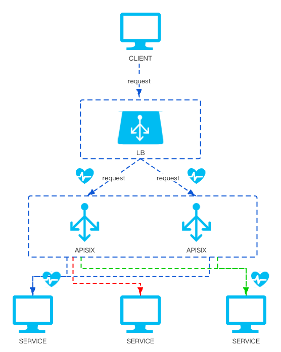
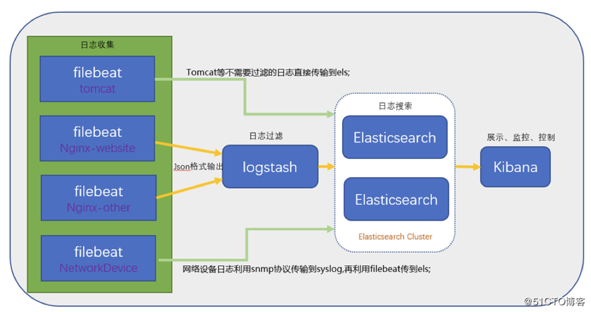

# 开箱即用 -- Apache APISIX 公有云高可用架构

Apache APISIX 作为 API 网关，往往会作为企业的边缘网关，承载绝大部分的南北向流量。运维常说5个'9'、4个'9'、3个'9'可靠性，对于边缘网关的可靠性要求往往要达到5个'9'，因为边缘网关对于内部服务的可用性至关重要，一旦边缘网关不可用，整个内部服务全都会受到影响。

> 什么是高可用？高可用 HA（High Availability）是分布式系统架构设计中必须考虑的因素之一，它通常是指，通过设计减少系统不能提供服务的时间。如果一个系统能够一直提供服务，那么这个可用性则是百分之百，但是天有不测风云。所以我们只能尽可能的去减少服务的故障。

## 写这篇文章的目的

1. 边缘网关地位至关重要，要有足够的稳定性（高可用）。APISIX 在生产环境中往往会作为边缘网关，作为整个内部服务的流量入口，牵一发而动全身，一旦边缘网关不可用，整个内部服务全都会受到影响。

2. 架构级高可用要有一定基础。设计边缘网关的高可用架构有一定门槛，不仅需要熟悉 Nginx、Apache APISIX 等边缘网关，还要有一定的高可用架构基础。

3. 缺少 Apache APISIX 高可用架构的分享。当前通过 baidu 或者 google 相关 APISIX 搜索结果往往是一些 APISIX 的入门使用，另一方面，核心维护者的几次宣讲主要也是从实现层面讲述 Apache APISIX 如何实现极高的转发性能（比如王院生的《 APISIX 高性能实践 》）。

## 公有云高可用架构

那么，如何设计公有云的高可用架构呢？

大多数人第一个想到会是 APISIX 数据面如何高可用。意识很好，但是不够，仅仅是数据面的高可用是不够的，因为控制面的路由配置和数据面的路由转发是相辅相成的，而且如果没有想清楚如何管理 API，如何保证 API 的正确性和一致性，在后续运维和使用的过程中，也会因为操作不当或者节点故障导致路由配置异常，影响数据面的路由转发，所以控制面关于路由规则的高可用也是需要考虑的。

那么这样就可以高枕无忧了吗？如果一旦请求出错如何去定位问题呢？千里之堤溃于蚁穴，在网关的小故障演变为大故障之前，如何提前发现网关的故障？网关往往会存储一些关键的用户信息或者证书信息，又如何保证其安全性呢？

所以，在 APISIX 本身高可用之外，也需要从日志和日志处理、监控和告警以及安全的角度分析如何实现基于公有云的边缘网关的高可用架构。

当然，开源的网关往往不是完美的，我们会在后面的剖析如何实现边缘网关的高可用架构的时候，发现当前 Apache APISIX 的一些缺点，比如不支持服务发现，也没有周边工具支持自动扩容缩容等问题，这个我会在最后简单说一下自己的看法以及解决办法。

### 数据面高可用（路由转发）

接入网关数据面的高可用一般方案是集群化或者是主备模式，另一方面，谁也无法保证接入网关某个节点一定不会故障，所以也需要能够自动发现故障节点从集群或者主备中剔除。在保证高可用的基础上，高性能也举足轻重。

所以，数据面高可用通常会从如下三个维度切入，以寻找合适的解决方案

- 集群化/主备模式
- 高性能
- 故障节点自动剔除

集群化是什么？集群是指作为一个整体向用户提供一组资源的计算节点。用户访问的时候并不会感知到这组计算节点的存在；另一方面，一个集群内的节点可以通过新增节点或者下线节点进行扩容和缩容。

主备模式是什么？主备模式（有时候也叫作双机热备）其实就是指一台服务器在提供服务，另一台为某服务的备用状态，当一台服务器不可用另外一台就会顶替上去。Keepalived是开源界中比较常见的解决方案。

集群化的部署性能会比较好，因为 APISIX 节点是横向扩展的，集群的转发也会随着节点数增加而增加，自然集群化部署会有一定技术门槛；而主备模式是单机转发能力即为上限，有一定局限性，但胜在简单易部署。建议大家在公有云上优先选择 APISIX 集群化。

当使用公有云进行集群化部署时，属于同一个业务的节点建议作为同一个 APISIX 的 upstream ，利用 APISIX 的负载均衡、心跳探测等能力，实现业务节点的集群化；而 APISIX 本身则建议利用公有云厂商的负载均衡服务（腾讯云的 CLB / 阿里云的 SLB ），将一组 APISIX 节点挂在负载均衡服务的一个规则后面，实现集群化。

为什么建议使用公有云厂商的负载均衡服务？因为如果想要将 APISIX 集群化部署，往往需要使用云厂商服务或者是自建负载均衡，如果要自建，那么从高可用的角度来讲，就还需要去解决负载均衡的高可用/集群化，这样其实便会很容易陷入重复造轮子的恶性循环中：为了省一点钱，而后期要花更多的人力去解决前向依赖组件的高可用问题。所以，APISIX 网关的集群化建议搭配云厂商的负载均衡。

当然，还有一种更好的方式则是可以选择公有云上的 API 网关服务，将自己的 API / Route 等托管到云厂商的 API 网关服务上，这样，下面的不论是 APISIX 本身的高可用还是周边组件的集成都可以不用考虑了，可以快速享受 API 网关带来的便捷。

集群化的另一个挑战就是需要能够主动将一组 APISIX 节点中出现故障的 APISIX 节点自动剔除。前面建议选用云厂商的负载均衡，那么在这里的故障剔除也会依赖于相关服务能力，比如使用四层的负载均衡通常是去探测相关端口是否通，使用七层的负载均衡则通常是根据配置构造HTTP请求，请求 APISIX 节点，检验其响应是否符合预期，若不符合预期且达到一定阈值则剔除问题 APISIX 节点。

### 控制面高可用（路由配置）

- Dashboard
- 安全性
- 可扩展性
- 配置一致性

### 日志和日志处理

- 日志格式
- 日志重定向和切割
- ELK/CLS（不建议自建）

### 监控和告警

当前APISIX监控指标：
请求返回码计数（counter）
时延（histogram）
带宽（counter）

### 安全

- 控制面：admin api安全问题
- 数据面：apisix prometheus接口安全问题
- 新版本：1.3 APISIX
- 其他：iptables访问控制/负载均衡等

## 架构总结

- 复用云上组件，减少运维工作量
- 控制面和数据面的高可用；日志、监控和安全很重要
- 需自建的组件优先考虑开源方案，优先考虑标准化

## 展望

